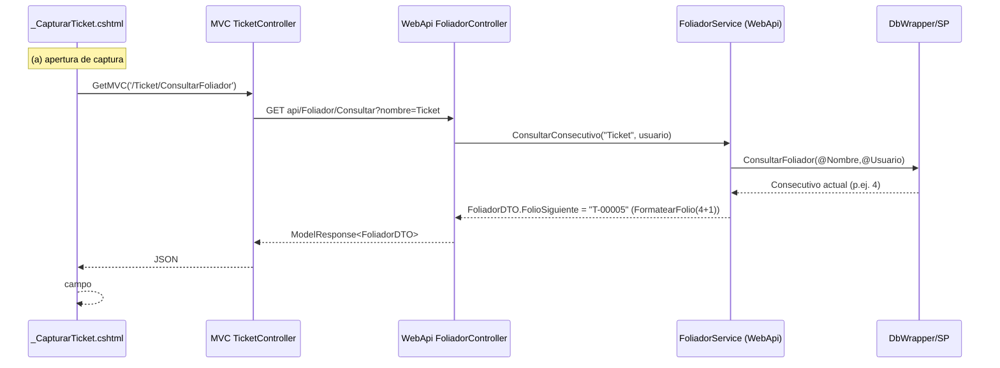
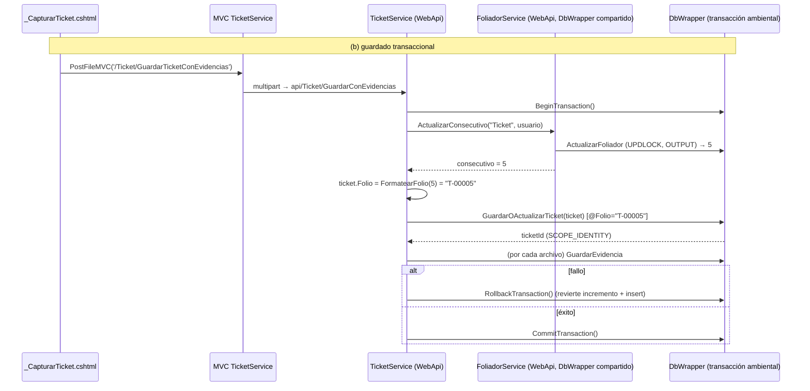

# Design: Foliador de Tickets (folio/consecutivo)

## Technical Approach

Asignar a cada ticket nuevo un folio único/secuencial por empresa (`T-00001`) generado atómicamente durante el guardado y persistido en `Ticket.Folio`. El consecutivo vive en una nueva tabla `Foliador` (una fila `Nombre='Ticket'` por `EmpresaId`). Se sigue el patrón `Evidencia` verificado en el código: tabla + SPs + `DbWrapper` parcial + service + controller mínimo, todo ADO.NET + stored procedures (EF Core está referenciado pero **no se usa**). El cálculo del formato `T-{Consecutivo:00000}` ocurre **solo** en la capa de servicio WebApi; `Ticket.Folio` almacena el string ya formateado. La UI muestra un preview advisory (`current+1`) en un campo deshabilitado; el valor persistido es el autoritativo.

## Architecture Decisions

| # | Decision | Choice | Alternatives rechazadas | Rationale |
|---|----------|--------|--------------------------|-----------|
| D1 | Data access | ADO.NET + SPs (patrón `Evidencia`/`DbWrapper`) | EF Core 3.1 (referenciado) | EF Core está referenciado pero sin DbContext/DI; toda la DAL real es `SqlConnection`/`SqlCommand`. |
| D2 | Incremento atómico | Un solo SP `ActualizarFoliador` con `UPDATE ... WITH (UPDLOCK, HOLDLOCK) SET Consecutivo = Consecutivo + 1 OUTPUT INSERTED.Consecutivo` | consultar+incrementar en C# (racy) | Evita duplicados bajo concurrencia; devuelve el valor nuevo en un solo statement (FOL-003). |
| D3 | Ubicación en transacción | Incremento + insert de ticket dentro del `BeginTransaction/Commit/Rollback` existente de `TicketService.GuardarTicketConEvidencias` | Incremento fuera de la transacción | FOL-004: si falla el insert, el incremento se revierte (sin huecos). |
| D4 | **DbWrapper compartido** | `TicketService` crea un `DbWrapper` y se lo pasa a `FoliadorService` (`new FoliadorService(_dbWrapper)`) | `FoliadorService` con su propio `new DbWrapper()` | `BaseDbWrapper` mantiene `_ambientConnection/_ambientTransaction` como **campos de instancia**. Una instancia `DbWrapper` distinta abriría otra conexión **fuera** de la transacción, rompiendo D3/FOL-004. |
| D5 | Scope por empresa | SPs derivan `@EmpresaId` de `@Usuario` (`SELECT EmpresaId FROM Usuarios WHERE NombreUsuario=@Usuario AND Estatus=1`) | pasar `EmpresaId` por claim | Consistente con `GuardarOActualizarTicket`, `GuardarEvidencia`, etc. El incremento y el insert derivan el **mismo** `EmpresaId` del mismo `@Usuario`. |
| D6 | Exposición limitada | `FoliadorController` expone **solo** `Consultar` (`[Authorize]`, sin ruta para actualizar); `ActualizarFoliador` existe en `DbWrapper`/`FoliadorService` pero **sin** action/route | exponer actualizar por HTTP | FOL-007. Cero mecanismo extra: no hay endpoint → 404. |
| D7 | Formato del folio | `static string FormatearFolio(int c) => $"T-{c:00000}"` en `FoliadorService`; usada para preview (`c+1`) y para persistencia (`c` recién incrementado) | formatear en MVC/UI | Único punto de verdad del formato, siempre en WebApi. |
| D8 | Semántica del update | `GuardarOActualizarTicket` guarda `@Folio` **solo en la rama INSERT**; la rama UPDATE no lo toca | sobrescribir `Folio` en UPDATE | Al editar un ticket, `Folio` viene `NULL` (campo display-only) y no debe borrar el folio existente. |

## Data Model

```sql
-- Foliador: un consecutivo por empresa y por Nombre (natural key).
CREATE TABLE [dbo].[Foliador] (
    EmpresaId         BIGINT      NOT NULL,
    FechaActualizacion DATETIME    NOT NULL CONSTRAINT DF_Foliador_FechaActualizacion DEFAULT (GETDATE()),
    Nombre            NVARCHAR(50) NOT NULL,
    Descripcion       NVARCHAR(250) NULL,
    Consecutivo       INT          NOT NULL CONSTRAINT DF_Foliador_Consecutivo DEFAULT ((0)),
    CONSTRAINT PK_Foliador PRIMARY KEY (EmpresaId, Nombre),
    CONSTRAINT FK_Foliador_Empresa FOREIGN KEY (EmpresaId) REFERENCES [dbo].[Empresa]([Id])
);

-- Ticket.Folio (nullable, sin backfill)
ALTER TABLE [dbo].[Ticket] ADD [Folio] NVARCHAR(50) NULL;
```

Entidades: `Catalogos/Foliador.cs` (EmpresaId, FechaActualizacion, Nombre, Descripcion, Consecutivo) y `Catalogos/FoliadorDTO.cs : Foliador` (+ `FolioSiguiente` string). `Ticket.cs` gana `public string Folio { get; set; }` (hereda a `TicketDTO`). Los SP de lectura (`ObtenerTickets`, `ObtenerTicketPorId`, `ObtenerTicketsPorArea`) usan `SELECT t.*`, por lo que `Folio` fluye automáticamente vía `LlenarEntidad<T>` — **no requieren cambios**.

## Stored Procedures

```sql
-- 1. ConsultarFoliador (público): devuelve la fila o vacío (sin error) si no existe (FOL-002).
CREATE PROCEDURE [dbo].[ConsultarFoliador]
    @Nombre NVARCHAR(50), @Usuario NVARCHAR(25)
AS BEGIN
    SET NOCOUNT ON;
    DECLARE @EmpresaId BIGINT;
    SELECT @EmpresaId = EmpresaId FROM Usuarios WHERE NombreUsuario = @Usuario AND Estatus = 1;
    SELECT EmpresaId, FechaActualizacion, Nombre, Descripcion, Consecutivo
    FROM Foliador WHERE EmpresaId = @EmpresaId AND Nombre = @Nombre;
END

-- 2. ActualizarFoliador (interno): upsert defensivo + incremento atómico; devuelve el nuevo valor (FOL-003).
CREATE PROCEDURE [dbo].[ActualizarFoliador]
    @Nombre NVARCHAR(50), @Usuario NVARCHAR(25)
AS BEGIN
    SET NOCOUNT ON;
    DECLARE @EmpresaId BIGINT;
    SELECT @EmpresaId = EmpresaId FROM Usuarios WHERE NombreUsuario = @Usuario AND Estatus = 1;
    IF @EmpresaId IS NULL BEGIN SELECT NULL; RETURN; END
    IF NOT EXISTS (SELECT 1 FROM Foliador WHERE EmpresaId = @EmpresaId AND Nombre = @Nombre)
        INSERT INTO Foliador (EmpresaId, FechaActualizacion, Nombre, Descripcion, Consecutivo)
        VALUES (@EmpresaId, GETDATE(), @Nombre, NULL, 0);
    UPDATE Foliador WITH (UPDLOCK, HOLDLOCK)
    SET Consecutivo = Consecutivo + 1, FechaActualizacion = GETDATE()
    OUTPUT INSERTED.Consecutivo
    WHERE EmpresaId = @EmpresaId AND Nombre = @Nombre;
END

-- 3. GuardarOActualizarTicket (+@Folio NVARCHAR(50) = NULL).
--    INSERT: añadir columna Folio y valor @Folio.
--    UPDATE: NO modificar Folio (preservar el existente al editar).
```

## Folio threading (MVC → WebApi → SP)

1. **Entities**: `Ticket.Folio` (string) — se serializa en el DTO y viaja en el objeto anónimo del DAL.
2. **MVC multipart** (`ServiceDeskDESIMVC/Services/TicketService.cs`, `GuardarTicketConEvidencias`): añadir
   `form.Add(new StringContent(ticket.Folio ?? string.Empty), "Folio");` junto a los demás campos.
3. **WebApi form parser** (`TicketController.LeerTicketDesdeForm`): añadir `ticket.Folio = form["Folio"];` (string, sin parse).
4. **DAL objeto anónimo** (`DbWrapper.Ticket.cs` `GuardarOActualizarTicket`): añadir `t.Folio` al `parametrosObj` (se emite `@Folio` vía `ObtenerParametrosSQL`).
5. **SP** `GuardarOActualizarTicket`: recibe `@Folio` y lo inserta (solo INSERT).

## Sequence Diagrams





## File Changes

| File | Action | Description |
|------|--------|-------------|
| `openspec/changes/foliador-tickets/migration.sql` | Create | Tabla `Foliador` + seed por empresa, `Ticket.Folio`, SPs `ConsultarFoliador`/`ActualizarFoliador`, `ALTER GuardarOActualizarTicket` (+@Folio). |
| `openspec/changes/foliador-tickets/rollback.sql` | Create | DROP SPs nuevos, DROP `Ticket.Folio`, DROP `Foliador`, restaurar `GuardarOActualizarTicket` previo. |
| `ServiceDeskDESIEntities/Catalogos/Foliador.cs` (+`.csproj`) | Create | Entidad `Foliador`. |
| `ServiceDeskDESIEntities/Catalogos/FoliadorDTO.cs` (+`.csproj`) | Create | `FoliadorDTO : Foliador` + `FolioSiguiente`. |
| `ServiceDeskDESIEntities/Tickets/Ticket.cs` | Modify | `+ public string Folio`. |
| WebApi `DAL/DbWrapper.Foliador.cs` (+`.csproj`) | Create | `ConsultarFoliador(...)` → `GetObject`; `ActualizarFoliador(...)` → `ExecuteScalar`. |
| WebApi `DAL/DbWrapper.Ticket.cs` | Modify | `+ t.Folio` en el objeto anónimo de `GuardarOActualizarTicket`. |
| WebApi `Services/FoliadorService.cs` (+`.csproj`) | Create | `ConsultarConsecutivo` (público), `ActualizarConsecutivo` (interno), `static FormatearFolio`. |
| WebApi `Services/TicketService.cs` | Modify | Inyectar `FoliadorService` con `_dbWrapper` compartido; calcular `ticket.Folio` dentro de la transacción. |
| WebApi `Controllers/FoliadorController.cs` (+`.csproj`) | Create | `[Authorize] [RoutePrefix("api/Foliador")]`, `[HttpGet, Route("Consultar")] Consultar(string nombre)`. |
| WebApi `Controllers/TicketController.cs` | Modify | `LeerTicketDesdeForm`: `+ ticket.Folio = form["Folio"];`. |
| MVC `DAL/HttpClientConnection.Foliador.cs` (+`.csproj`) | Create | `ConsultarFoliador()` → `RequestAsync<FoliadorDTO>("api/Foliador/Consultar?nombre=Ticket", GET)`. |
| MVC `Services/FoliadorService.cs` (+`.csproj`) | Create | `ConsultarFolioSiguiente()` wrapper. |
| MVC `Services/TicketService.cs` | Modify | `+ Folio` al `MultipartFormDataContent`. |
| MVC `Controllers/TicketController.cs` | Modify | `+ [HttpGet] ConsultarFoliador()` (JSON). |
| MVC `Views/Ticket/_CapturarTicket.cshtml` | Modify | Campo `#Folio` disabled + populate en `shown.bs.modal`. |

## Legacy .csproj registration

Los tres proyectos usan `.csproj` no-SDK con `<Compile Include>` explícito. Cada archivo `.cs` nuevo requiere su entrada manual:

- `ServiceDeskDESIEntities.csproj` → `<Compile Include="Catalogos\Foliador.cs" />` y `...FoliadorDTO.cs`.
- `ServiceDeskDESIWebApi.csproj` → `DAL\DbWrapper.Foliador.cs`, `Services\FoliadorService.cs`, `Controllers\FoliadorController.cs`.
- `ServiceDeskDESIMVC.csproj` → `DAL\HttpClientConnection.Foliador.cs`, `Services\FoliadorService.cs`.

## Migration / Rollout

Sin runner de migraciones: `migration.sql` se aplica **manualmente** contra la DB hosted (`db_9c7990_servicedeskdesi`). Idempotente: `IF OBJECT_ID(...) IS NULL` para la tabla/columna, `DROP PROCEDURE`+`CREATE` para SPs. El seed inserta `Nombre='Ticket'` (`Consecutivo=0`) por cada `Empresa` existente (`INSERT ... SELECT e.Id, ... FROM Empresa e WHERE NOT EXISTS(...)`). Rollback en `rollback.sql` (orden inverso). El preview "current+1" es advisory; bajo concurrencia el valor persistido puede diferir (stored wins — FOL-005).

## Testing Strategy

| Layer | What to Test | Approach |
|-------|-------------|----------|
| DB | FOL-003 concurrencia | Ejecutar `ActualizarFoliador` en 2 sesiones paralelas → valores distintos, sin duplicados. |
| WebApi | FOL-004 atomicidad | Forzar fallo de `GuardarEvidencia` tras el incremento → `RollbackTransaction` revierte el incremento (sin hueco). |
| WebApi | FOL-007 | Confirmar que no existe ruta HTTP para actualizar (404). |
| E2E | FOL-001/005 | Guardar ticket → `Folio='T-00001'`; abrir captura → preview `T-00002`. |

## Open Questions

Ninguna bloqueante. (El DTO de preview `FolioSiguiente` es la única superficie de diseño "extra" respecto al proposal; si se prefiere, MVC puede formatear localmente usando `FormatearFolio` exportado.)
